# Latest E-Commerce Shipping Software Collection (With Detailed Pricing Analysis)

Running an online store means wrestling with carrier comparisons, label printing chaos, and customers demanding instant tracking updates across multiple sales channels. The right e-commerce shipping software consolidates carrier rates, automates label generation, and syncs order data from Shopify to Amazon to WooCommerce without manual data entry. This curated overview covers 23 multi-carrier shipping platforms ranked by automation depth, international capabilities, and cost-effectiveness, helping you cut fulfillment time from hours to minutes while reducing shipping expenses up to 90%.

***

## **[Easyship](https://easyship.com)**

Cloud-based global shipping platform connecting 100,000+ merchants with 250+ couriers across 220 countries for seamless international fulfillment.

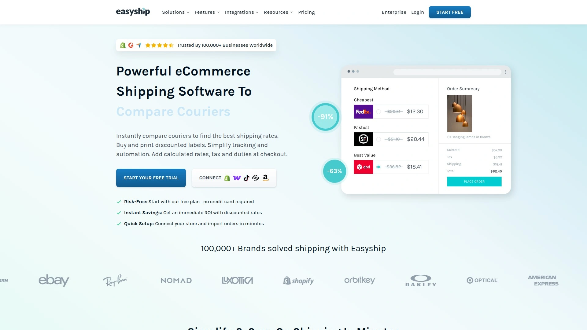

Founded in 2014, Easyship transformed cross-border e-commerce by automating customs documentation, duty calculations, and international tax compliance that typically require manual research. The platform integrates directly with Shopify, WooCommerce, BigCommerce, Amazon, Etsy, Kickstarter, and Indiegogo, automatically importing order details the moment customers check out. Pre-negotiated carrier rates deliver savings up to 91% off standard shipping costs with partners including DHL, FedEx, UPS, USPS, Aramex, and Singapore Post. Real-time rate comparison at checkout shows customers exact costs before purchase, reducing cart abandonment from shipping surprise fees. Automated duty and tax calculation generates accurate customs declarations eliminating clearance delays. The shipping dashboard provides instant visibility across all orders, carriers, and destinations with batch label printing handling hundreds of shipments simultaneously. Branded tracking pages display your logo and colors, maintaining customer relationships throughout delivery rather than redirecting to generic carrier sites. Free plan supports up to 50 monthly shipments with basic features, while Plus and Premier tiers unlock volume discounts, advanced analytics, and dedicated account management.

---

## **[ShipStation](https://www.shipstation.com)**

Comprehensive fulfillment hub processing over 1 billion orders annually for 180,000+ e-commerce sellers across all major marketplaces.

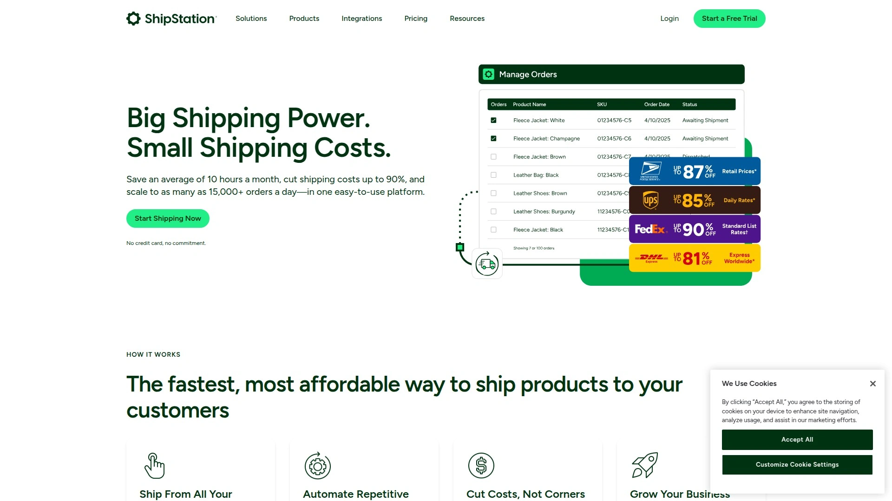

ShipStation operates as the industry standard for high-volume multi-channel sellers, integrating with 300+ platforms including every major marketplace, cart system, and carrier. The centralized dashboard imports orders automatically from all connected stores, applying preset automation rules that assign carriers, print labels, and update tracking based on destination, weight, or product type. Advanced filtering lets you segment shipments by order characteristics, creating batch workflows that process hundreds of orders with single clicks. Rate shopping compares live pricing across 40+ carriers including USPS, UPS, FedEx, DHL, ensuring optimal cost and delivery speed for every package. Customizable packing slips and branded tracking emails maintain your visual identity throughout the post-purchase experience. Inventory sync tracks stock levels across multiple warehouses preventing oversells when fulfilling from distributed locations. The mobile app enables label printing and order management from anywhere using smartphones or tablets. Enterprise features include multi-user accounts with permission controls, advanced reporting on shipping performance, and API access for custom integrations. Pricing starts at $9.99 monthly for 50 shipments scaling to $159.99 for 6,000+ orders, with volume discounts negotiated directly with carriers added on top of platform fees.

***

## **[Shippo](https://goshippo.com)**

Developer-friendly shipping API offering 85+ carrier integrations with transparent pay-as-you-go pricing starting completely free.

Shippo emphasizes simplicity and affordability, providing full-featured shipping tools without monthly minimums or subscription commitments. The clean interface requires minimal learning curve, making it ideal for new sellers transitioning from manual shipping processes. Connections to Shopify, WooCommerce, Wix, Magento, and custom storefronts automatically sync order data enabling one-click label creation. Carrier support spans USPS, UPS, FedEx, DHL, and 80+ international and regional carriers with pre-negotiated rates saving up to 90% off retail shipping costs. Address validation automatically corrects customer-entered addresses reducing delivery failures and returned packages. Batch label printing processes multiple orders simultaneously with customizable label formats supporting various printer types. Branded tracking notifications keep customers informed with emails displaying your logo and brand colors. API documentation enables developers to embed shipping functionality directly into custom applications and workflows. Free starter plan allows 30 labels monthly with no platform fees, only paying actual carrier costs. Pro plan at $10 monthly includes advanced features like multi-user access, carrier accounts, and white-label branding. The straightforward pricing model scales cost-effectively as order volume grows without surprising price jumps.

***

## **[Ordoro](https://www.ordoro.com)**

All-in-one platform combining shipping automation with inventory management for sellers needing unified order and stock control.

Ordoro differentiates by integrating shipping and inventory into single workflows, eliminating the need for separate systems that create data synchronization headaches. The platform connects to 30+ carriers and 20+ sales channels including Amazon, eBay, Shopify, WooCommerce, and Walmart. Real-time inventory tracking automatically updates stock levels across all connected stores when items ship, preventing oversells during multichannel selling. Barcode scanning speeds warehouse operations with pick-and-pack verification ensuring correct items reach customers. Dropshipping automation routes orders to appropriate suppliers with automated purchase order generation and tracking updates. Returns management streamlines the reverse logistics process with customer-facing return portals and automated restocking workflows. Advanced analytics provide insights into shipping costs, popular carriers, delivery performance, and inventory turnover helping identify optimization opportunities. Multi-warehouse support enables strategic inventory placement closer to customers reducing shipping costs and delivery times. The interface prioritizes operational efficiency with keyboard shortcuts and batch actions minimizing clicks required for routine tasks. Pricing starts at $59 monthly for basic features scaling to $499 for enterprise capabilities including unlimited users and advanced automation rules.

***

## **[ShippingEasy](https://shippingeasy.com)**

Beginner-friendly automation platform owned by Stamps.com offering discounted USPS and UPS rates with integrated email marketing.

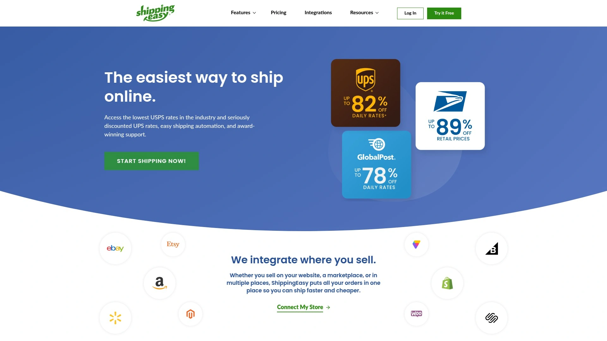

ShippingEasy targets small businesses and growing sellers who need straightforward shipping without overwhelming feature complexity. The platform automatically imports orders from Shopify, BigCommerce, WooCommerce, Amazon, eBay, Etsy, and 40+ other channels. Preset automation rules apply shipping preferences based on order characteristics like destination, weight, or product type eliminating repetitive decision-making. Discounted carrier rates through partnerships with USPS and UPS provide commercial pricing without negotiating carrier contracts directly. Customizable packing slips and shipping labels include your branding maintaining professional appearance throughout fulfillment. Built-in email marketing tools let you nurture customer relationships with automated post-purchase campaigns, review requests, and promotional messages. Returns management provides customers with self-service portals reducing support ticket volume. The mobile app extends functionality to iOS and Android devices enabling shipping from anywhere. Free plan supports up to 25 monthly shipments making it accessible for side businesses and new sellers. Paid tiers start at $19.99 for 200 shipments scaling incrementally based on volume. The acquisition by Stamps.com in 2018 strengthened technical infrastructure while maintaining the user-friendly interface that attracted small sellers initially.

***

## **[AfterShip](https://www.aftership.com)**

Post-purchase experience platform tracking shipments across 1,138 carriers with branded tracking pages and proactive delivery notifications.

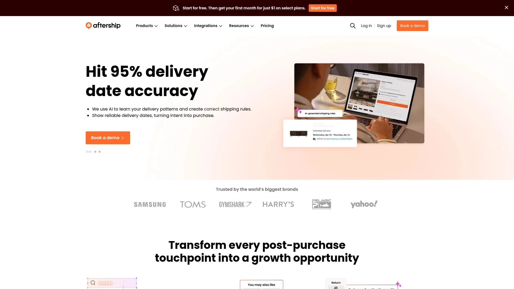

AfterShip specializes in the customer experience after checkout, transforming generic carrier tracking into branded touchpoints that drive repeat purchases. The platform automatically detects carriers from tracking numbers, importing shipment data from major carriers worldwide without manual configuration. Branded tracking pages display shipment progress using your logo, colors, and domain maintaining customer relationships throughout delivery. Proactive notifications alert customers to shipment milestones including out-for-delivery and delivery confirmation reducing "where's my order" support inquiries. Estimated delivery date calculation uses carrier data and AI predictions providing accurate arrival expectations that improve customer satisfaction. Product recommendations on tracking pages drive additional revenue by displaying relevant items while customers wait for deliveries. Analytics dashboards reveal delivery performance across carriers, identifying delays and issues that impact customer experience. Exception management alerts your team to delivery problems enabling proactive outreach before customers complain. Integrations with Shopify, WooCommerce, Magento, and major platforms automatically import tracking numbers as orders ship. Returns management streamlines reverse logistics with customer-facing return portals and automated workflows. Pricing starts free for 50 shipments monthly scaling to paid plans based on tracking volume and feature requirements.

***

## **[Freightview](https://www.freightview.com)**

Freight-focused shipping platform simplifying LTL and truckload bookings with rate comparison across dozens of carriers.

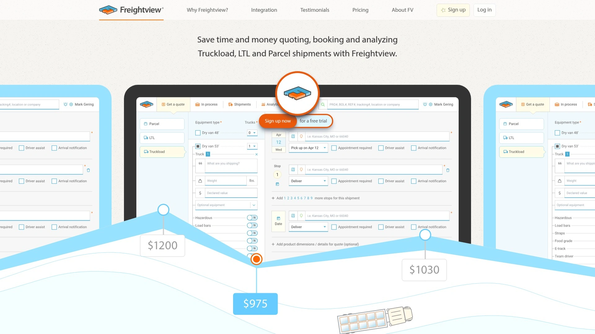

Freightview serves businesses shipping palletized freight and large items that exceed standard parcel dimensions and weights. The platform provides instant rate quotes from 80+ LTL carriers including major names and regional specialists, displaying costs side-by-side for easy comparison. Booking happens directly through Freightview with automatic tender to selected carriers and pickup scheduling. Built-in messaging tools facilitate carrier communication keeping all correspondence organized within the platform rather than scattered across email. Document management stores bills of lading, delivery receipts, and proof of delivery in centralized locations accessible to your entire team. Shipment tracking provides visibility as freight moves through carrier networks with milestone updates. Detailed analytics reveal shipping spend patterns, carrier performance, and cost-saving opportunities helping optimize freight strategies. The platform handles complex freight requirements including lift-gate service, inside delivery, and residential destinations. Address book functionality stores frequently used locations speeding quote and booking processes. Integrations with ERP and WMS systems automate data flow eliminating manual entry between systems. Pricing follows usage-based models with monthly fees determined by shipment volume rather than flat subscriptions.

***

## **[ShipBob](https://www.shipbob.com)**

Full-service 3PL offering distributed fulfillment network with proprietary software managing inventory across facilities.

ShipBob differs from pure software platforms by providing physical warehousing and fulfillment services alongside the technology orchestrating operations. The company operates fulfillment centers strategically located across the United States, Canada, United Kingdom, European Union, and Australia. Merchants ship inventory to ShipBob facilities where warehouse teams receive, store, pick, pack, and ship orders as they arrive from your online stores. The cloud-based dashboard provides complete visibility into inventory levels, order status, and fulfillment metrics across all locations. Distributed inventory placement enables 2-day ground shipping to most destinations by storing products closer to customers reducing both costs and delivery times. Direct integrations with Shopify, WooCommerce, Amazon, and major platforms automatically route orders to optimal fulfillment locations. Carrier partnerships with USPS, UPS, FedEx, and regional carriers ensure competitive shipping rates passed through to merchants. Kitting and customization services enable bundling products, adding promotional inserts, and creating unique unboxing experiences. Returns processing handles reverse logistics including inspection, restocking, and customer communications. Transparent pricing includes receiving, storage, and fulfillment fees with shipping costs calculated separately based on actual carrier charges. The model suits brands ready to outsource warehousing and fulfillment entirely while maintaining operational visibility through software.

***

## **[ShipHero](https://shiphero.com)**

Warehouse management system combining inventory control with shipping automation for brands operating their own fulfillment centers.

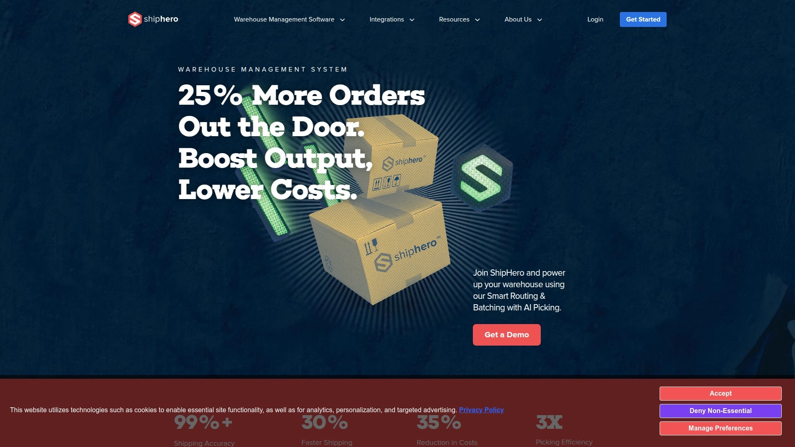

ShipHero targets merchants who self-fulfill from owned or leased warehouses rather than outsourcing to third-party logistics providers. The mobile-first platform runs on iOS and Android devices enabling barcode scanning, pick-and-pack workflows, and inventory management from handheld devices. Receiving workflows guide warehouse staff through incoming shipment verification, putaway location assignment, and inventory record updates. Wave and batch picking optimizes order fulfillment by grouping shipments with similar items or destinations reducing warehouse travel time. Packing station integration connects to scales and label printers automatically calculating dimensional weights and generating shipping labels. Cycle counting tools maintain inventory accuracy with scheduled physical counts and automated variance reporting. Multi-location support tracks inventory across multiple warehouses and retail locations with transfer order management between facilities. Shipping rate shopping compares carrier options in real-time selecting optimal cost and service combinations. The platform connects to 50+ carriers and 100+ sales channels synchronizing order and inventory data bidirectionally. Advanced reporting provides insights into warehouse efficiency, picking accuracy, and inventory turnover guiding operational improvements. Pricing scales based on order volume starting around $1,295 monthly for basic plans reaching enterprise tiers supporting high-volume operations.

***

## **[Veeqo](https://www.veeqo.com)**

Amazon-owned multi-channel shipping and inventory platform offering free access with up to 5% cashback on shipping.

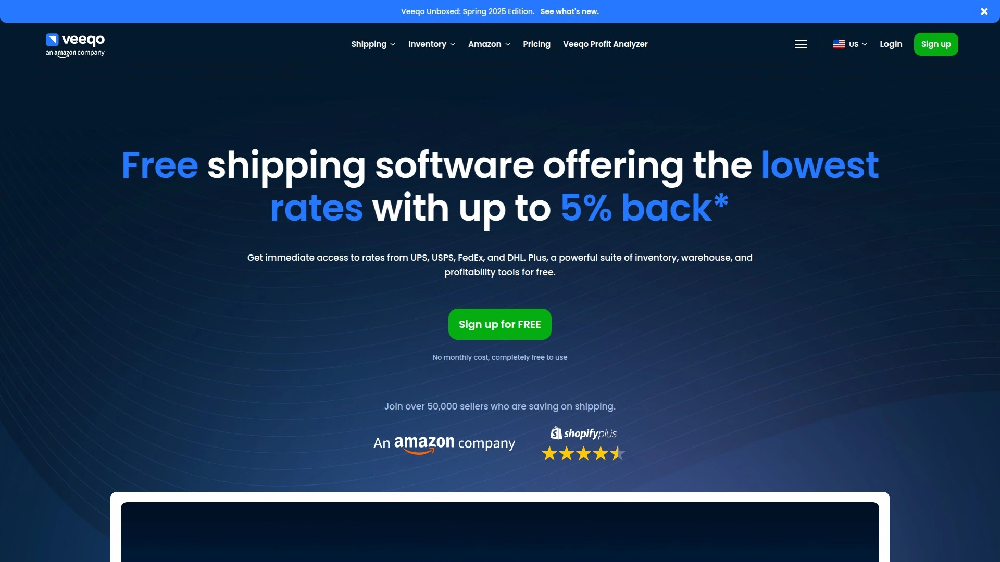

Acquired by Amazon in 2021, Veeqo provides completely free access to its full feature set without monthly subscription fees or shipment limits. The platform connects to 30+ carriers including FedEx, UPS, DHL, and USPS with pre-negotiated discounted rates plus additional cashback on qualifying shipments. Multi-channel inventory synchronization prevents oversells by updating stock levels in real-time across connected stores as orders ship. Automated rate shopping compares carrier options for each shipment recommending optimal cost-service combinations. Bulk label printing processes hundreds of orders simultaneously with customizable label formats supporting various printer types. Forecasting tools predict future inventory needs based on historical sales patterns helping maintain optimal stock levels. Pick lists optimize warehouse workflows by grouping orders with similar items or locations. Returns management provides customer-facing portals and automated restocking workflows. Detailed analytics reveal shipping performance, carrier reliability, and cost-saving opportunities. The Amazon acquisition brought enterprise-grade infrastructure and additional carrier partnerships previously unavailable to independent platforms. Integration with Amazon's fulfillment network enables hybrid fulfillment strategies using both merchant-fulfilled and FBA channels. The free pricing model funded by Amazon makes Veeqo compelling for sellers seeking robust features without budget concerns.

***

## **[EasyPost](https://www.easypost.com)**

Developer-focused shipping API powering logistics for major enterprises with AI-driven rate optimization and extensive documentation.

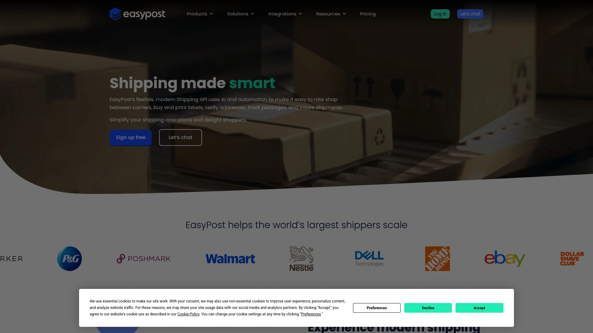

EasyPost provides shipping capabilities through RESTful API rather than traditional user interfaces, targeting technical teams building custom fulfillment systems. The platform integrates with 100+ carriers worldwide including USPS, FedEx, UPS, DHL, regional carriers, and international postal services. SmartRate API analyzes historical delivery performance data recommending optimal carrier selections balancing cost and delivery speed. Address verification uses USPS and international address databases ensuring accuracy before labels print reducing delivery failures. Insurance options protect high-value shipments with simple claim processes when packages suffer damage or loss. Tracking webhooks push real-time status updates to your systems as shipments progress enabling proactive customer communications. Customs documentation generation automates international shipping paperwork including commercial invoices and customs declarations. Extensive API documentation with code examples in Python, Ruby, Node.js, PHP, Java, and C# accelerates integration development. Test environment provides sandbox functionality for development without incurring actual shipping charges. Usage-based pricing charges per API call with volume discounts for high-traffic applications. Enterprise plans include dedicated support, SLA guarantees, and custom integrations. The developer-friendly approach makes EasyPost ideal for technical teams requiring deep integration control rather than pre-built user interfaces.

***

## **[ShipEngine](https://www.shipengine.com)**

Enterprise shipping API platform powering over 1 billion annual shipments for major brands with advanced rate shopping and tracking.

ShipEngine delivers shipping capabilities through modern RESTful API designed for high-volume e-commerce operations and enterprise applications. The platform connects to major carriers including FedEx, UPS, USPS, DHL, and dozens of international and regional carriers. Real-time rate shopping retrieves live pricing across carriers enabling dynamic carrier selection based on cost and service requirements. Label generation supports various formats and printer types with batch creation handling thousands of labels simultaneously. Address validation uses carrier databases ensuring deliverability before shipment processing. Package tracking provides unified status updates across carriers with webhooks pushing real-time events to your systems. Manifest creation generates end-of-day paperwork required by carriers for pickup and billing. Advanced features include parcel insurance, signature requirements, and delivery confirmations. Comprehensive documentation with code samples accelerates integration across programming languages and frameworks. Test environment enables development and testing without live shipments or charges. The platform emphasizes reliability with 99.9% uptime SLA and redundant infrastructure. Usage-based pricing with volume discounts scales cost-effectively as shipment volume grows. ShipStation and Stamps.com ownership provides deep carrier relationships and infrastructure supporting enterprise-scale operations.

***

## **[Sendcloud](https://www.sendcloud.com)**

European shipping automation platform connecting to 160+ carriers with comprehensive international coverage across 40+ countries.

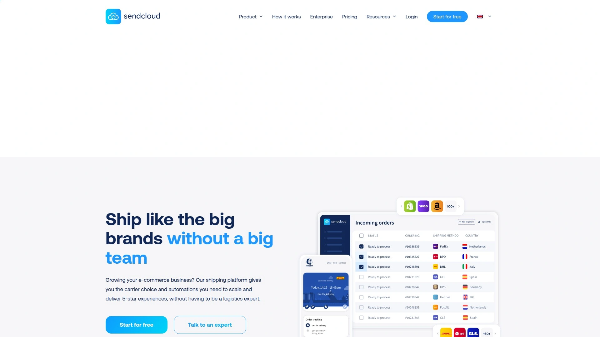

Sendcloud dominates European e-commerce shipping with deep integrations to regional carriers often overlooked by American-focused platforms. The platform connects to major European carriers including DPD, DHL, PostNL, Colissimo, and dozens of country-specific postal services. Checkout integration displays accurate shipping rates and delivery estimates before purchase reducing cart abandonment. Automated carrier selection applies preset rules choosing optimal carriers based on destination, dimensions, and cost parameters. Bulk label printing processes hundreds of shipments simultaneously with customizable label formats. Branded tracking emails and pages display your logo and colors maintaining customer relationships throughout delivery. Returns portal provides customers with self-service return initiation and label generation reducing support workload. Multi-carrier parcel tracking consolidates shipment visibility across carriers in unified dashboards. Address validation uses European postal databases ensuring deliverability across diverse addressing formats. International shipping automation handles customs documentation, duties, and taxes for cross-border European shipments. Warehouse management features include barcode scanning, pick-and-pack workflows, and inventory tracking. API access enables custom integrations for technical teams requiring programmatic control. Pricing starts at €39 monthly for 200 shipments scaling based on volume and features. The strong European carrier network makes Sendcloud essential for merchants serving European customers.

***

## **[Parcel Perform](https://www.parcelperform.com)**

AI-powered delivery intelligence platform providing advanced analytics and predictive insights across global carrier networks.

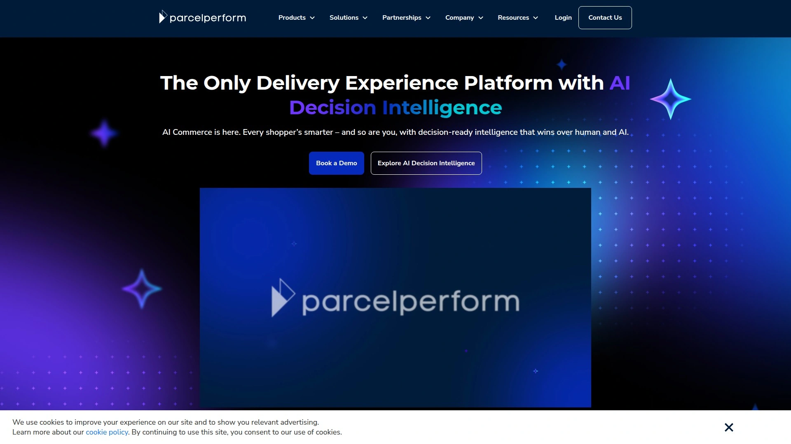

Parcel Perform focuses on the data and analytics layer above shipping execution, helping enterprises optimize logistics through AI-driven insights. The platform connects to 900+ carriers worldwide tracking parcels across complex international networks. AI-powered delivery predictions analyze historical carrier performance, weather, capacity constraints, and regional patterns forecasting accurate delivery times. Exception management identifies potential delays before they impact customers enabling proactive communications and recovery actions. Carrier performance benchmarking reveals reliability differences across carriers, lanes, and service levels guiding procurement decisions. Carbon footprint tracking quantifies environmental impact of shipping decisions supporting sustainability reporting and optimization. Customer communication automation sends proactive notifications keeping customers informed throughout delivery journeys. Returns intelligence analyzes return patterns identifying product quality issues and fraudulent return behaviors. The platform targets enterprise retailers, logistics providers, and marketplaces processing millions of annual shipments. Integration happens through API, file upload, or direct carrier connections depending on technical capabilities. Comprehensive dashboards visualize delivery performance across geographies, carriers, and service levels. Custom reporting generates insights specific to your business requirements and KPIs. Enterprise pricing reflects the advanced analytics capabilities and high-volume processing requirements of target customers.

***

## **[Stamps.com](https://www.stamps.com)**

Official USPS partner providing discounted postage and shipping labels for USPS and UPS with desktop software integration.

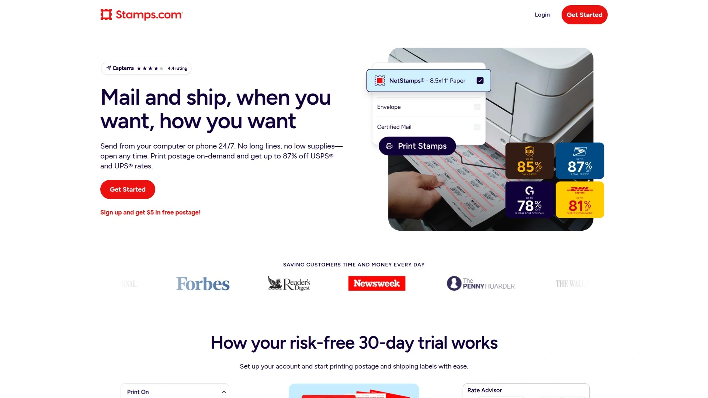

Stamps.com pioneered online postage bringing commercial USPS pricing to small businesses without requiring direct USPS accounts. The platform provides access to all USPS services including Priority Mail, First-Class, Media Mail, and Express with discounts up to 89% off retail rates. Desktop software integrates with common printers enabling label printing directly from your computer without dedicated label printers. Address book functionality stores frequently used addresses accelerating repeat shipments. Batch processing handles multiple packages simultaneously calculating rates and printing labels in bulk. Package tracking retrieves USPS scan data providing visibility as mail moves through postal networks. Integrations with eBay, Etsy, Amazon, and PayPal automatically import order details for label creation. USPS pickup scheduling arranges carrier pickup at your location eliminating trips to post offices. Certified mail and return receipts provide proof of delivery for legal and critical mailings. Scale integration automatically captures package weights eliminating manual entry. The platform exclusively focuses on USPS and UPS limiting carrier diversity compared to multi-carrier platforms. Pricing starts at $19.99 monthly plus postage costs with unlimited label printing. The longstanding USPS partnership and desktop software make Stamps.com familiar to businesses preferring traditional software over web applications.

***

## **[Endicia](https://www.endicia.com)**

USPS-focused shipping platform owned by Stamps.com specializing in international mail with comprehensive customs automation.

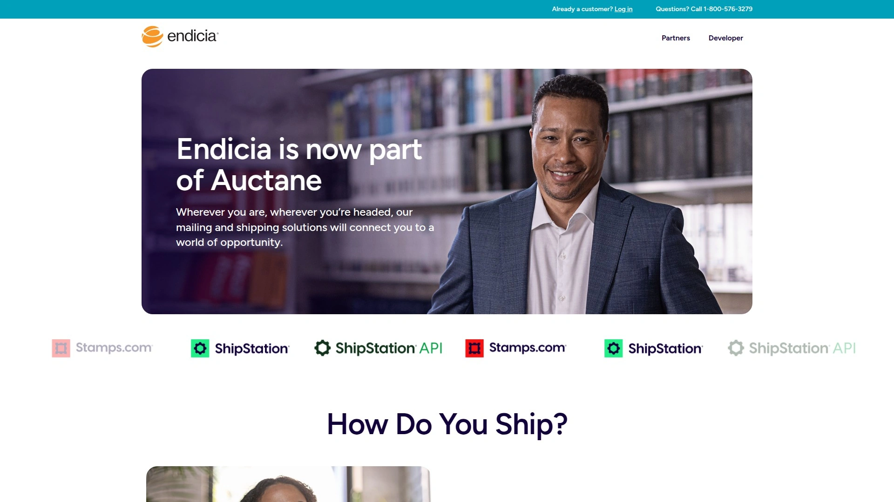

Endicia operates as Stamps.com's international shipping brand, providing advanced tools for cross-border USPS services. The platform excels at customs documentation generation, automatically creating customs forms and commercial invoices required for international mail. Address verification uses USPS and international postal databases ensuring deliverability across global addressing formats. Duty and tax calculation estimates customs charges customers may encounter providing transparency before purchase. Country-specific regulations guidance helps navigate prohibited items and documentation requirements reducing customs delays. Desktop software and web interface options accommodate different user preferences and workflow requirements. Integration with major e-commerce platforms automatically imports international orders for processing. Barcode scanning and batch processing accelerate high-volume operations. Detailed reporting tracks international shipping costs, delivery performance, and customs clearance times. USPS pickup scheduling arranges carrier collection at your location. The platform charges $19.99 monthly plus actual postage costs with volume discounts available. While USPS-exclusive, Endicia provides deeper international capabilities than general multi-carrier platforms. The combination with Stamps.com gives merchants flexible options choosing platforms based on domestic versus international shipping needs.

***

## **[Shiprocket](https://www.shiprocket.in)**

India's largest e-commerce shipping platform connecting to 29+ courier partners with 27,000+ pin code coverage nationwide.

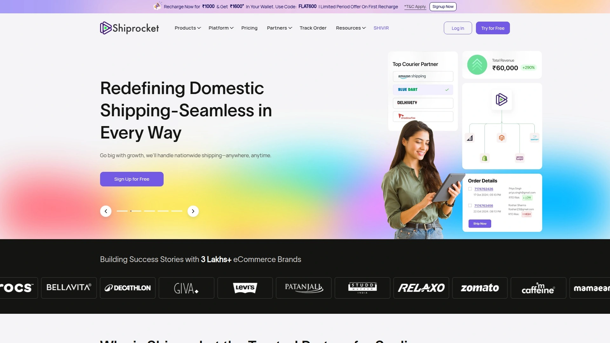

Shiprocket dominates Indian e-commerce logistics providing shipping infrastructure for domestic and international Indian sellers. The platform integrates with 29+ Indian courier services including Delhivery, Blue Dart, Ecom Express, FedEx India, and Aramex. Pan-India coverage reaches 27,000+ pin codes including tier-2 and tier-3 cities often challenging for direct carrier relationships. Weight reconciliation technology disputes incorrect weight-based charges from carriers protecting against overbilling. Cash-on-delivery reconciliation automates COD payment collection and remittance reducing reconciliation complexity. Real-time tracking aggregates status updates across diverse Indian courier networks into unified views. NDR management handles non-delivery reports with automated customer outreach improving delivery success rates. Returns management streamlines reverse logistics with QC checks and automated restocking. International shipping enables Indian sellers to reach global markets through partnerships with international couriers. Payment options include prepaid, COD, and multiple payment gateway integrations. Mobile app brings full functionality to smartphones enabling shipping management anywhere. Shopify, WooCommerce, Magento, and marketplace integrations automatically sync orders for processing. Shiprocket Fulfillment provides optional warehousing and fulfillment services beyond pure shipping software. Pricing follows pay-per-use model charging per shipment without monthly subscriptions making it accessible for new sellers.

***

## **[Metapack](https://www.metapack.com)**

Enterprise delivery management platform used by major retailers orchestrating complex fulfillment across global carrier networks.

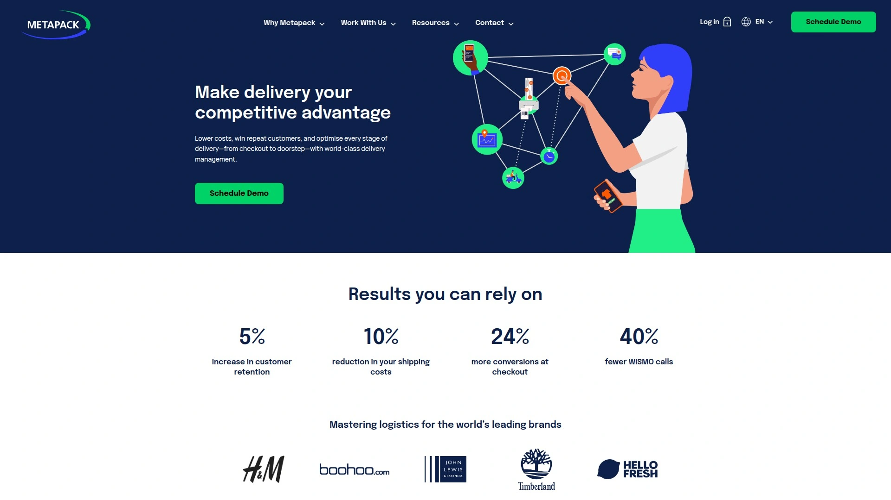

Metapack serves large retailers and brands with sophisticated multi-carrier strategies requiring enterprise-grade orchestration. The platform connects to 400+ carriers worldwide enabling truly global fulfillment reach. Delivery promise accuracy uses real-time carrier capacity, inventory location, and delivery performance data generating precise customer commitments. Carrier selection rules automatically choose optimal carriers based on cost, speed, sustainability, and capacity constraints. Delivery experience management provides branded tracking and proactive exception handling maintaining customer relationships. Returns orchestration streamlines reverse logistics across carriers and locations with automated routing and processing. Sustainability reporting quantifies carbon emissions across shipping operations supporting environmental commitments. API-first architecture enables deep integration with existing order management, warehouse, and customer systems. The platform handles millions of daily shipments for major retailers requiring enterprise reliability and scalability. Advanced analytics provide insights into carrier performance, delivery success rates, and cost optimization opportunities. White-label capabilities enable retailers to embed delivery experiences maintaining brand consistency. Implementation requires significant technical and business resources given enterprise complexity. Pricing follows enterprise model with setup fees and ongoing platform charges reflecting sophistication and scale.

***

## **[Pirate Ship](https://www.pirateship.com)**

Free shipping software providing deeply discounted USPS and UPS rates without monthly fees, subscriptions, or hidden charges.

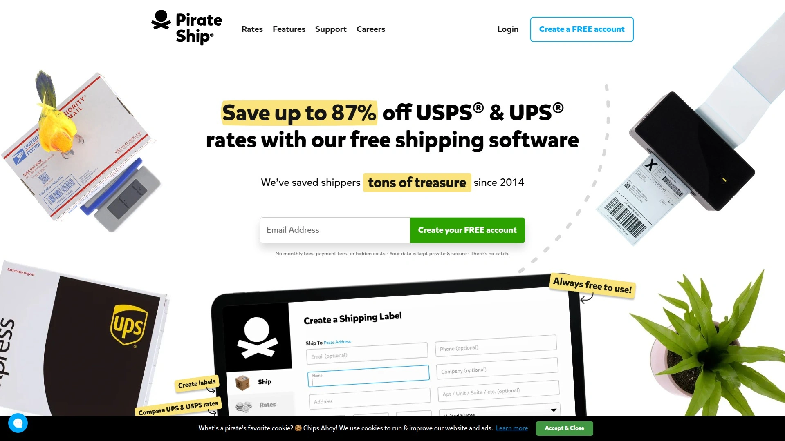

Pirate Ship revolutionized shipping pricing by offering commercial carrier rates completely free without software fees or subscription requirements. The platform provides USPS Priority Mail, First-Class, and Express services plus UPS Ground at commercial rates typically requiring high-volume contracts. No monthly fees, per-label charges, or markup on postage means you pay only actual carrier costs. Simple web interface requires minimal learning curve with straightforward label creation workflows. Automatic best rate suggestions compare USPS and UPS options recommending cheapest qualifying services. Batch label creation processes multiple shipments simultaneously though features remain basic compared to paid platforms. Address validation reduces delivery failures by correcting customer-entered addresses before labels print. Package pickup scheduling arranges USPS and UPS collection at your location. Integration options remain limited compared to enterprise platforms though CSV import enables basic batch processing. The completely free model makes Pirate Ship ideal for small sellers, hobbyists, and businesses with straightforward shipping needs. Lack of advanced automation, inventory management, and enterprise features means growing businesses often outgrow the platform. However, the zero-cost entry and substantial rate discounts provide compelling value for price-conscious shippers.

***

## **[ProShip](https://proshipinc.com)**

Enterprise parcel and LTL shipping software for mid-market and large businesses with advanced rate shopping and complex routing.

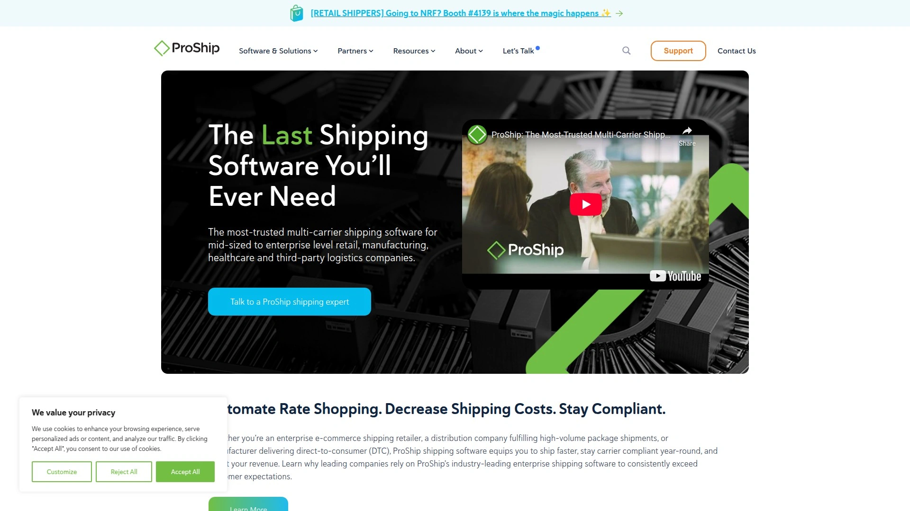

ProShip serves mid-market to enterprise businesses shipping 5,000+ daily parcels requiring sophisticated transportation management. The platform handles both parcel and LTL freight enabling unified management of diverse shipment types. Advanced rate shopping evaluates dozens of carrier options considering service levels, surcharges, and contractual rates selecting optimal choices. Complex business rules accommodate sophisticated shipping strategies including split shipments, freight optimization, and multi-warehouse scenarios. Carrier connectivity spans global networks with support for international carriers and regional specialists. Hazmat and dangerous goods support handles regulatory compliance for restricted shipments. On-premise, cloud, and hybrid deployment options accommodate varying IT requirements and security policies. Integration with ERP, WMS, and OMS systems creates seamless data flow across enterprise technology stacks. The WorldLink product targets smaller businesses shipping 100-5,000 daily parcels with simplified feature sets. Both products emphasize configurability enabling customization matching unique business requirements. Implementation requires significant time and resources given enterprise complexity. Pricing reflects mid-range to high positioning with setup and licensing fees plus ongoing support costs. The platform serves companies outgrowing entry-level tools requiring enterprise capabilities without full TMS complexity.

***

## **[ShippyPro](https://www.shippypro.com)**

Italian shipping software connecting to 160+ carriers with strong European coverage and advanced label generation capabilities.

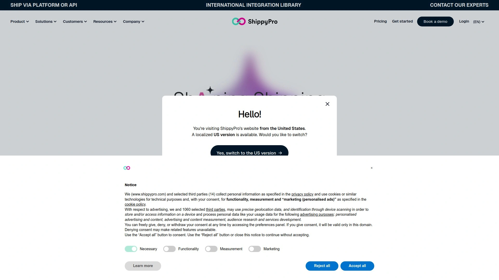

ShippyPro originated in Europe providing shipping automation with particular strength in European carrier networks. The platform connects to 160+ carriers including major international brands and European regional specialists. Label generation creates batch shipments with bulk printing handling hundreds of orders simultaneously. Dynamic checkout integration displays accurate shipping rates and delivery estimates before customer purchase. Tracking management aggregates shipment status across carriers providing unified visibility. Returns portal enables customer self-service reducing support ticket volume. Shipping analytics reveal cost patterns, carrier performance, and optimization opportunities. Address validation uses international postal databases ensuring deliverability across global addressing conventions. Customs documentation automation generates paperwork required for international shipments. Marketplace integrations include Amazon, eBay, Etsy, and European platforms. The platform particularly suits European sellers and international businesses serving European markets. Interface supports multiple languages reflecting international focus. Pricing tiers based on shipment volume with basic plans starting around €29 monthly. The European origin and carrier focus differentiate ShippyPro from American-centric competitors making it valuable for businesses operating in or shipping to Europe.

***

## **[ShipRush](https://www.shiprush.com)**

Desktop shipping software for Windows and Mac providing multi-carrier management with QuickBooks integration.

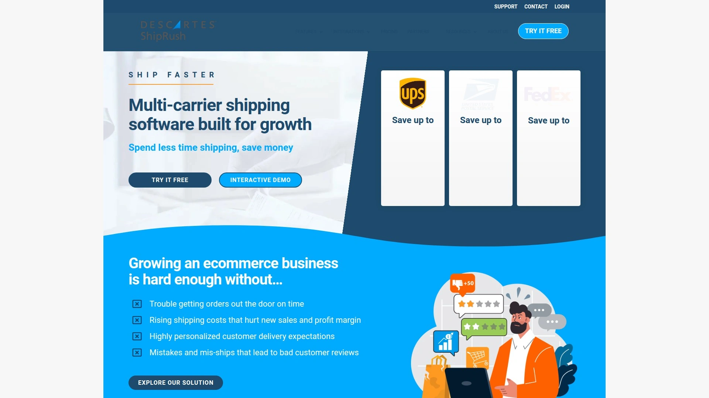

ShipRush operates as traditional desktop software appealing to businesses preferring installed applications over cloud platforms. The software supports major carriers including USPS, FedEx, UPS, and DHL with rate shopping across services. QuickBooks integration synchronizes shipping costs with accounting records eliminating manual data entry. Order import from e-commerce platforms and marketplaces automates label creation workflows. Batch processing handles multiple shipments with preset rules applying carrier selections. Address validation reduces delivery failures by correcting addresses before labels print. Customizable packing slips and shipping labels include branding elements. Scale integration captures package weights automatically. The desktop model enables offline functionality when internet connectivity proves unreliable. Perpetual licensing options provide one-time purchase alternatives to subscription models. While cloud platforms dominate modern shipping software, ShipRush maintains loyal user base preferring desktop applications. The software particularly appeals to businesses using QuickBooks requiring tight integration. Feature development pace lags cloud-native competitors though core functionality remains solid. Pricing includes one-time license fees or subscription options depending on preference. The desktop focus creates niche positioning as most competitors emphasize cloud delivery.

***

## **[ReadyShipper](https://www.readyshipper.com)**

Small business shipping software emphasizing simplicity with multi-carrier support and QuickBooks integration.

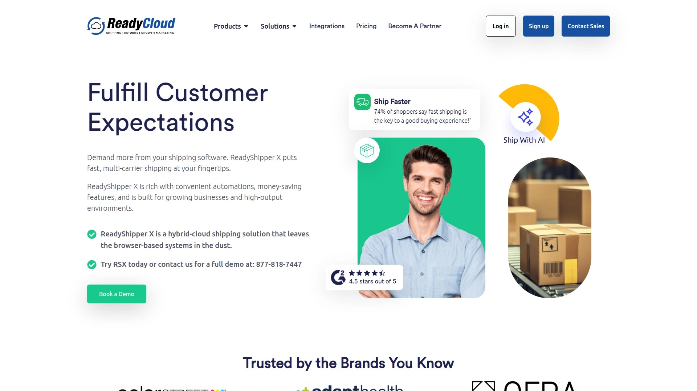

ReadyShipper targets small businesses needing straightforward shipping without overwhelming complexity or high costs. The platform connects to major carriers including USPS, FedEx, UPS, and DHL providing rate comparison. Integration with QuickBooks synchronizes shipping costs with financial records maintaining accounting accuracy. Order import from e-commerce platforms automates label creation eliminating manual data entry. Address validation uses carrier databases reducing delivery failures from incorrect addresses. Batch processing handles multiple shipments applying preset carrier selections. Tracking number management sends updates to customers keeping them informed. The simple interface requires minimal training enabling quick onboarding. Pricing starts around $19 monthly making it accessible for small operations. Feature set remains basic compared to enterprise platforms though covers essential shipping needs. The platform suits businesses outgrowing manual processes but not requiring advanced automation. Customer support receives positive feedback for responsiveness and helpfulness. While lacking cutting-edge features, ReadyShipper delivers reliable core functionality at affordable pricing appealing to budget-conscious small businesses seeking straightforward carrier integration.

***

## **[Xternal](https://www.xternaltechnologies.com)**

Enterprise shipping execution software for high-volume distribution centers requiring warehouse integration and complex rating.

Xternal serves large warehouses and distribution centers shipping thousands of daily parcels requiring sophisticated transportation management. The platform handles parcel, LTL, and truckload shipments through unified workflows. Advanced rating engines evaluate complex carrier contracts including dimensional pricing, accessorial charges, and zone-based rates. Warehouse management integration connects with WMS systems enabling seamless pack-and-ship workflows. Manifesting generates carrier-specific end-of-day documentation required for billing and pickup. Multi-site support manages shipping across distributed facilities with centralized visibility and control. Complex business rules accommodate sophisticated shipping strategies including freight optimization and mode selection. The platform emphasizes configurability enabling customization matching unique operational requirements. On-premise deployment options accommodate enterprise security and data residency requirements. Implementation requires significant IT resources and timeline given complexity. Pricing follows enterprise model with substantial licensing and implementation costs. The platform targets businesses outgrowing mid-market tools requiring true enterprise capabilities. Feature sophistication comes with corresponding complexity requiring dedicated personnel for administration and optimization.

***

## **[ShipCompliant](https://www.shipcompliant.com)**

Specialized compliance platform for alcohol shipping handling state-by-state regulations and tax reporting.

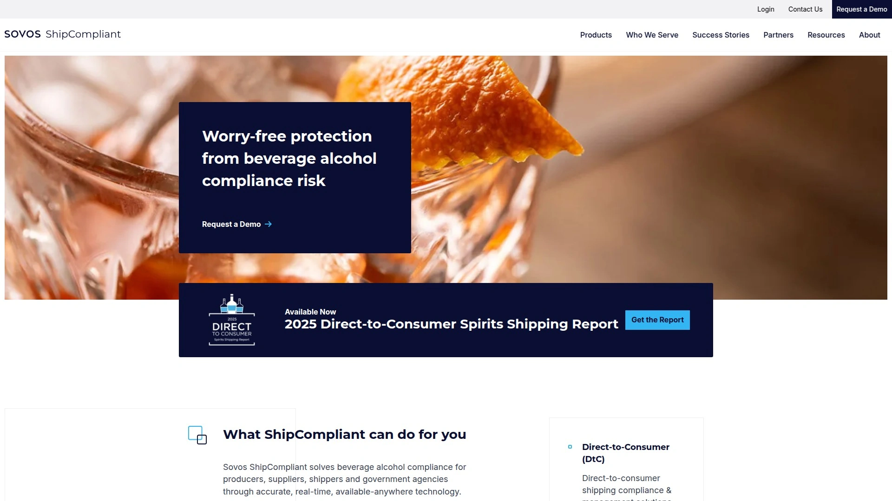

ShipCompliant addresses the unique challenges of alcohol shipping navigating complex state-by-state regulations governing wine, beer, and spirits. The platform maintains current knowledge of shipping laws, tax rates, and licensing requirements across all states. Order validation screens shipments ensuring compliance before processing preventing regulatory violations. Tax calculation and remittance automates sales tax and excise tax obligations simplifying complex multi-state tax filing. Label generation includes required compliance warnings and recipient age verification language. Carrier integration connects to alcohol-approved shipping services including FedEx and UPS licensed programs. License management tracks permits and renewals ensuring continuous compliance. Reporting generates documentation required for regulatory filings and audits. The platform serves wineries, breweries, distilleries, and online alcohol retailers requiring specialized compliance expertise. Implementation includes compliance consulting helping establish proper licensing and procedures. Pricing reflects specialized nature with setup fees and ongoing platform charges. The niche focus makes ShipCompliant essential for alcohol shippers unable to manage compliance manually. General shipping platforms lack the regulatory knowledge and automation required for legal alcohol distribution across state lines.

***

## FAQ

**How much can I save using multi-carrier shipping software versus carrier retail rates?**

Commercial rates through shipping platforms typically save 50-89% off retail carrier pricing, with exact savings depending on service types and volumes. USPS Priority Mail savings reach 89% through platforms like Pirate Ship or Stamps.com, while UPS and FedEx discounts range 30-60% based on negotiated contracts. For a business shipping 100 packages monthly, savings often exceed the platform subscription costs within the first few shipments.

**Do I need my own carrier accounts or can I use platform-negotiated rates?**

Most platforms offer pre-negotiated carrier rates you can use immediately without establishing direct carrier accounts. Easyship, Shippo, and ShipStation provide instant access to discounted rates from day one. However, high-volume shippers with established carrier contracts can connect those accounts to platforms like ShipStation or Ordoro, potentially saving additional percentages beyond platform rates while maintaining software automation benefits.

**Which shipping software works best for international e-commerce sellers?**

[Easyship](https://easyship.com) leads international shipping through automated duty calculation, customs documentation, and 250+ global carrier connections across 220 countries. The platform eliminates the typical complexity of cross-border selling by handling tax calculations, customs forms, and international carrier selection automatically. Alternatively, Sendcloud excels for European operations while Shiprocket dominates Indian domestic and international shipping.

***

## Conclusion

The right e-commerce shipping software transforms fulfillment from daily chaos into automated workflows that process hundreds of orders with minimal manual intervention, cutting shipping costs 50-90% while providing customers with accurate tracking and delivery estimates. [Easyship](https://easyship.com) stands out for international sellers needing seamless cross-border capabilities with automated customs, duty calculations, and global carrier access that makes worldwide shipping as simple as domestic fulfillment. Match your specific needs—domestic volume shipping, international expansion, or warehouse management—to the appropriate platform and reclaim hours previously spent manually comparing rates and printing labels.
